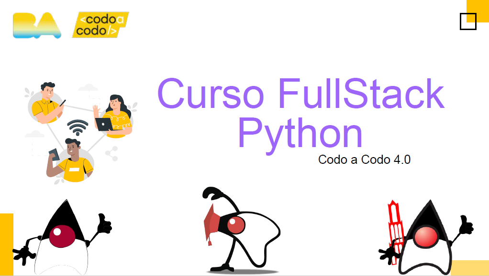
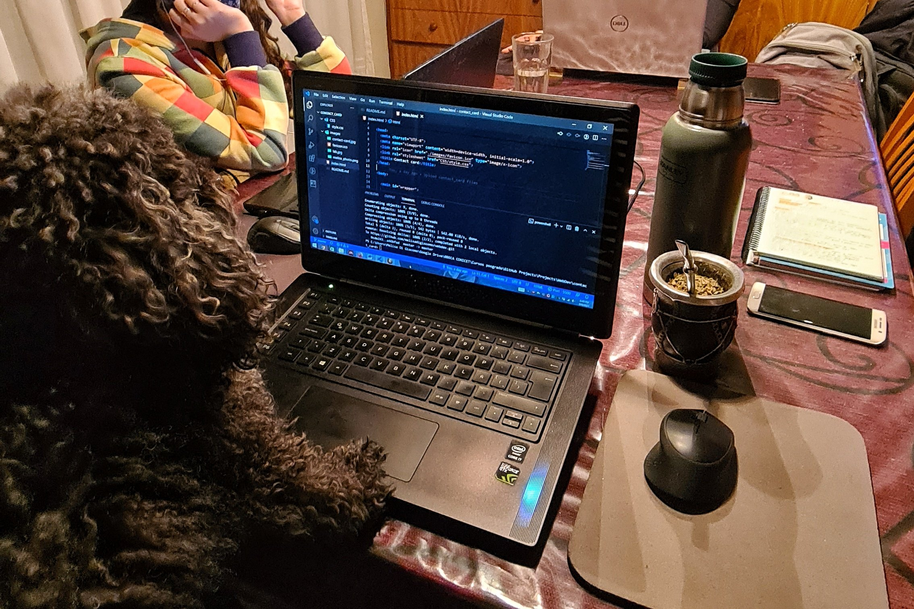
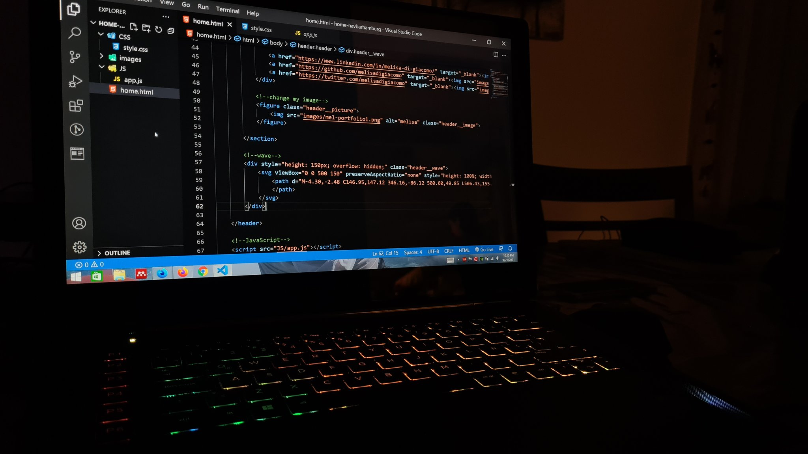

##  [#100DaysOfCode](https://twitter.com/hashtag/100DaysOfCode?src=hashtag_click)

I share my 100 Days of Code Challenge. I really recommend it! It kept my constancy and showed me how much I've learn during those days!

### Follow me: [@melisadigiacomo](https://twitter.com/melisadigiacomo)  

 
## Skills and resources  

## Day by day challenge

| Day       | Project               | Description                                      | Language/Resource |
| --------- | --------------------- | ------------------------------------------------ | ----------------- |
| [01](#01) | HTML test             | Passed HTML test                                 | HTML              |  
| [02](#02) | New Dev Community     | Interacted with new fellows of bootcamp          | Social Media      |   
| [03](#03) | ggplot2 plots         | Improved some plots and practice ggplot2         | R                 |   
| [04](#04) | Plot evolution        | Added a new repo on GitHub with plot evolution   | R                 |   
| [05](#05) | Vacations info web    | Developed a simple web to share vacations info   | HTML - CSS        |   
| [06](#06) | HTML test and Netlify | Passed HTML test and opened a Netlify account    | HTML              |   
| [07](#07) | CSS theory            | Studied color theory, shapes and positions       | CSS               |   
| [08](#08) | Layouts               | Practised different layouts                      | HTML - CSS        |   
| [09](#09) | {CSS animation}       | Studied and practised CSS animation              | CSS               |   
| [10](#10) | Layouts               | Practised layouts for different devices          | HTML - CSS        |    
| [11](#11) | CSS GRID and Flexbox  | Studied and practised CSS GRID and Flexbox       | HTML - CSS        |    
| [12](#12) | Portfolio             | Started craning my web portfolio                 | Pen - Paper       |    
| [13](#13) | Contact card          | Developed a contact card                         | HTML - CSS        |    
| [14](#14) | CSS positions         | Studied and practiced CSS positions              | CSS               |   
| [15](#15) | Linktree clone        | Developed my own Linktree page                   | HTML - CSS        |    
| [16](#16) | CSS flexbox           | Practised CSS Flexbox by playing games           | CSS               |    
| [17](#17) | Icons links page      | Developed an icons links page                    | HTML - CSS        |    
| [18](#18) | Tech talks            | Attended TechNFest Globant inspiring talks       | Talks             |    
| [19](#19) | Simple website        | Developed a website while coding live in class   | HTML - CSS        |    
| [20](#20) | CSS theory            | Studied CSS {transition} and {animation}         | CSS               |    
| [21](#21) | CSS practice          | Practised CSS {transition} and {animation}       | CSS               |    
| [22](#22) | CSS animation         | Practised keyframes - CSS {animation}            | CSS               |    
| [23](#23) | CSS media queries     | Practised media queries                          | CSS               |    
| [24](#24) | Responsive navbar     | Developed responsive navbar with hamburger menu  | HTML - CSS        |    
| [25](#25) | Animated plot         | Coded in Python with plotly for an animated plot | Python            |    
| [26](#26) | Portfolio             | First approach to my future portfolio            | HTML - CSS        |    
| [27](#27) | Bootstrap             | Studied and practised Bootstrap                  | CSS - Bootstrap   |    
| [28](#28) | Portfolio             | Started a contact page for my portofolio         | HTML - CSS        |    
| [29](#29) | Javascript theory     | First approach to Javascript                     | JS                |    
| [30](#30) | Javascript theory     | Javascrit class                                  | JS                |    
| [31](#31) | Javascript theory     | Practised JS fundamentals playing games          | JS                |    
| [32](#32) | Responsive navbar     | Responsive navbar with hamburger menu in JS      | JS                |    
| [33](#33) | Javascript theory     | if, ?, swithc, loops and functions               | JS                |    
| [34](#34) | SPA                   | Developed a single page application for a brand  | HTML - CSS - JS   |    
| [35](#35) | Responsive SPA        | Made single page application responsive          | HTML - CSS - JS   |    
| [36](#36) | Javascript theory     | Practised arrow functions                        | JS                |    
| [37](#37) | Javascript theory     | JS callbacks and closures                        | JS                |    
| [38](#38) | Javascript theory     | JS promises and async/await                      | JS                |    
| [39](#39) | Username search app   | Developped a simple app using JS and GitHub API  | HTML - CSS - JS   |    
| [40](#40) | Javascript theory     | JS arrays and their methods                      | JS                |    
| [41](#41) | Weather app           | Developed a JS weather app                       | HTML - CSS - JS   |    
| [42](#42) | Data analysis class   | Coded in Python using pandas                     | Python            |    
| [43](#43) | Javascript theory     | DOM and its methods                              | JS                |    
| [44](#44) | Art Gallery webpage   | Started developing a page to show my artwork     | HTML - Bootstrap  |    
| [45](#45) | Art Gallery webpage   | Finished and deployed page on Netlify            | HTML - Bootstrap  |  
| [46](#46) | Javascript theory     | localStorage and sessionStorage objects          | JS                |  
| [47](#47) | Portfolio             | Worked in form validation using JavaScript       | JS                |  
| [48](#48) | Portfolio             | Improve my contact form: functional and secure   | HTML - CSS - JS   |  
| [49](#49) | Vue.js introduction   | Was introduced to Vue.js in class                | Vue.js            |  
| [50](#50) | JS frameworks         | Made a deeper search on different JS frameworks  | React - Angular   |  
| [51](#51) | Linktree clone        | Developed a custom Linktree clone for my IG      | HTML - CSS - JS   |  
| [52](#52) | Hide token/API keys   | Searched different forms to hide a token or key  | Tutorials         |  
| [53](#53) | Hide token/API keys   | Used environment variable to hide API key        | dotenv            |  
| [54](#54) | Portfolio             | Looked for free hosting for my portfolio         | Netlify - Vercel  |  
| [55](#55) | Portfolio             | Deployed my WEB PORTFOLIO                        | HTML - CSS - JS   |  
| [56](#56) | Portfolio             | Shared things I took into account for portofolio | HTML - CSS - JS   |  
| [57](#57) | Portfolio             | Modified projects section to let the user select | HTML - CSS - JS   |  
| [58](#58) | Databases             | Relational and non-relational databases          | Databases         |  
| [59](#59) | Databases             | Create database, insert into table, select from  | SQL               |  
| [60](#60) | Stocks data analysis  | Data analysis of active stocks                   | Python            |  
| [61](#61) | Stocks data analysis  | Finished active stocks analysis and report       | Python            |  
| [62](#62) | Databases             | Data Definition Language (DDL)                   | SQL               |  
| [63](#63) | Databases             | Data Manipulate Language (DML)                   | SQL               |  
| [64](#64) | Databases             | Data Control Language (DCL) and TCL              | SQL               |  
| [65](#65) | Databases             | SQL JOINS                                        | SQL               |  
| [66](#66) | Databases             | SQL aggregate functions                          | SQL               |  
| [67](#67) | Databases             | MySQL practice with world database               | SQL               |  
| [68](#68) | Shiny App workshop    | Signed up for LatinR and attended a workshop     | R                 |  
| [69](#69) | LatinR talks          | Attended interesting talks: R + Science          | R                 |  
| [70](#70) | Data Viz repo         | Started a repo with charts and R codes           | R                 |  
| [71](#71) | Data Viz repo         | Added more chart types to the repo               | R                 |  
| [72](#72) | Python theory         | Python for back end, refreshing concepts         | Python            |  
| [73](#73) | Python theory         | Built-in data types                              | Python            |  
| [74](#74) | Python theory         | Python operators                                 | Python            |  
| [75](#75) | Python theory         | Conditions and loops                             | Python            |  
| [76](#76) | Python theory         | Python functions                                 | Python            |  
| [77](#77) | Data Viz website      | Developed an R dataviz cheatsheet website        | HTML - CSS - JS   |  
| [78](#78) | Python theory         | Lambda                                           | Python            |  
| [79](#79) | Python theory         | Lists and arrays                                 | Python            |  
| [80](#80) | Python theory         | Object-oriented programming (OOP)                | Python            |  
| [81](#81) | Python theory         | Object-oriented programming (OOP)                | Python            |  
| [82](#82) | Biological webpage    | Developed a webpage to present in a congress     | HTML - CSS        |  
| [83](#83) | Python theory         | Errors and exceptions, how to handle them        | Python            |  
| [84](#84) | Python theory         | Recursive functions                              | Python            |  
| [85](#85) | Python practice       | Random walks, list searchs and seconds lived     | Python            |  
| [86](#86) | Python practice       | Fibonacci, Pascal triangle, tower simulation     | Python            |  
| [87](#87) | Python practice       | Sorting algorithms                               | Python            |  
| [88](#88) | Python practice       | Sorting algorithms II                            | Python            |  
| [89](#89) | Data Viz website      | Update website and repo by adding new plots      | R - HTML          |  
| [90](#90) | Python tests          | Passed Python tests of the bootcamp              | Python            |  
| [91](#91) | Django introduction   | Installed it and started my first project        | Django            |  
| [92](#92) | Django theory         | Read Django documentation and practiced          | Django            |  
| [93](#93) | Django debugging      | Debugged in VSCode and Django Debug Toolbar      | Django            |  
| [94](#94) | Django theory         | Django templates                                 | Django            |  
| [95](#95) | Django practice       | Developed an Employees Management App            | Django            |  
| [96](#96) | CSS Art               | Christmas tree in pure CSS                       | CSS               |  
| [97](#97) | Django theory         | Django and form                                  | Django            |  
| [98](#98) | Django practice       | Forms and databases in Employees Admin App       | Django            |  
| [99](#99) | Django practice       | Static & dynamic content in Employees Admin App  | Django            |  
| [100](#100) | Django practice     | Reviewing HTML, CSS, JS, SQL and Python          | All               |  

## #100DaysofCode Challenge  

## **Day 01** 

After starting a Python Full Stack bootcamp a few days ago, I passed my first HTML test.

  

## **Day 02** 

Started to interact with other fellows of the Full Stack course. Good communication and group support are key to clearing up doubts and discussing different approaches.

## **Day 03** 

Practiced with ggplot2 to improve some plots.

  

## **Day 04** 

I added a new [GitHub repo](https://github.com/melisadigiacomo/plotevolution) showing plot evolution.

  

## **Day 05** 

Practised some HTML and CSS. I created a simple web to organize and share with friends the info for our next weekend vacations.

 

## **Day 06** 

* Passed my last HTML test.
* Opened a Netlify account for my future hostings.
* Started my own list of useful websites and twitter content for web dev.

## **Day 07** 

Dived deeply in color theory, shapes and position in CSS. My first steps in the front-end web dev!

## **Day 08** 

Practised and compared different layouts! Composition, balance, and how to manage a good structure.

## **Day 09** 

It was all about movement! I played around while learning {animation} in CSS.  
[GitHub repo](https://github.com/melisadigiacomo/webdev/tree/master/waves_CSSanimation)

 

## **Day 10** 

Practised layouts for different devices.
[GitHub repo](https://github.com/melisadigiacomo/webdev/tree/master/CSSgrid)

 

## **Day 11** 

Studied and practised CSS GRID and Flexbox. Used it to display testimonials of Uritorco mountain located in Argentina. Inspired by my next mountain trek!  
[GitHub repo](https://github.com/melisadigiacomo/webdev/tree/master/CSS_FLEXBOX%26GRID])

 

## **Day 12** 

Started craning my web portfolio for the final frontend project.

## **Day 13** 

Making some progress in a link page and a contact card.
[GitHub repo](https://github.com/melisadigiacomo/webdev/tree/master/contact_card)

 

## **Day 14** 

Studied and practiced CSS positions. Sunday of coworking with family. 

 

## **Day 15** 

Coded my own Linktree page with HTML and CSS.

 

## **Day 16** 

Practised CSS Flexbox by playing games.  
[Flexbox Froggy](https://flexboxfroggy.com/#es)  
[More CSS games](https://css-tricks.com/snippets/css/a-guide-to-flexbox/)

## **Day 17** 

Developed another links page.  
(A) Linktree™ clone and (B) icon links page.  
[GitHub repo](https://github.com/melisadigiacomo/webdev/tree/master/links-page)

## **Day 18** 

Explored some inspiring talks of #TechNFest organized by Globant.

## **Day 19** 

We coded live on the class and I developed a simple website with some of the slide of CSS that I've made while studying. We practised semantic tags, flexbox and much more!

## **Day 20** 

Studied and compared CSS {transition} and {animation}.  

## **Day 21** 

Put into practice yesterday lesson of CSS {transition} and {animation}.  
[GitHub repo](https://github.com/melisadigiacomo/webdev/tree/master/transition-animation)

## **Day 22** 

Monday fun day! And more Pac-man! I learned a lot more of CSS {animation}.  
[GitHub repo](https://github.com/melisadigiacomo/webdev/tree/master/transition-animation)

## **Day 23** 

Experimented more of responsive design using media queries.

## **Day 24** 

Developed a responsive navbar with a hamburger menu with HTML and CSS while practising media queries.  
[GitHub repo](https://github.com/melisadigiacomo/webdev/tree/master/navbar-responsive)

## **Day 25** 

I had to make an animated plot for data viz, so I coded in Python using plotly.  
[GitHub repo](https://github.com/melisadigiacomo/dataviz-plotly)

## **Day 26** 

First approach to my future portfolio! Made it from scratch.

## **Day 27** 

I'm getting into CSS frameworks, specifically into Bootstrap!

## **Day 28** 

Started the contact page for my portfolio. Practice with forms, flexbox, media queries and some Bootstrap.

## **Day 29** 

The day has come! I met JavaScript for the first time! I started with some theory of Javascript basic concepts.

## **Day 30** 

Student's Day in Argentina, celebrating it with a JavaScript class.

## **Day 31** 

Learning is fun so I tried Grasshopper App and completed Javascript Fundamentals I and II.  
[Grass Hopper Game](https://learn.grasshopper.app/)

## **Day 32** 

I wanted to make a responsive navbar with hamburger menu using JavaScript.  
[GitHub repo](https://github.com/melisadigiacomo/webdev/tree/master/navbar-responsive-js)

## **Day 33** 

Another JavaScript class! ‘if’ statement, conditional operator ‘?’, ‘switch’ statement, loops and functions.

## **Day 34** 

Developed a single page application (SPA) for a brand to show its products.
[GitHub repo](https://github.com/melisadigiacomo/product-landingpage)
[Live](https://melisadigiacomo.github.io/product-landingpage/)

## **Day 35** 

Made SPA responsive. [LIVE](https://melisadigiacomo.github.io/product-landingpage/)   
I applied for the GitHub Student Developer Pack!

## **Day 36** 

Rewrote many functions using arrow functions to practise their syntax () => {}

## **Day 37** 

JavaScript callbacks and closures.

## **Day 38** 

Dived into Javascript Promises and async/await.  

## **Day 39** 

Developed a username search app using JavaScript and Github API. Learned a lot in the process! I used callbacks and Promises.

## **Day 40** 

JavaScript [Arrays] and their methods.

## **Day 41** 

Finished the weather app and practised a lot more of JavaScript. I used OpenWeatherMap API and Unsplash Source, an API for embedding photos from Unsplash.  
[GitHub repo](https://github.com/melisadigiacomo/weather-application)  
[LIVE](melisadigiacomo.github.io/weather-app/)

## **Day 42** 

Python coding for a data analysis course! Pandas module.

## **Day 43** 

DOM and its methods! I was already manipulating DOM with JS in some projects but in today’s class we dived more into the fundamentals.  

## **Day 44** 

Started building a page to show my artwork! Hope to finish tomorrow! I am a huge fan of photography, videos, digital illustration and gif animation.

## **Day 45** 

Publish my art gallery page on Netlify. Developed using Bootstrap.
[GitHub repo](https://github.com/melisadigiacomo/my-art-gallery)
[Live](melisagallery.netlify.app)

## **Day 46** 

JavaScript class: web storage objects localStorage and sessionStorage. Their methods and properties.

## **Day 47** 

Worked in form validation using JavaScript!

## **Day 48** 

Continued to improve my contact form. I used an API to fetch the submissions and added a honeypot to detect bots.

## **Day 49** 

In today's class we were introduced to Vue.js! I need to keep practising Vanilla JavaScript to then jump to a framework.
I asked how to choose a JS framework and preferences and got awesome advices:  
[Link to tweet](https://twitter.com/melisadigiacomo/status/1449174222442536962)

## **Day 50** 

I made a deeper seach on different JS FRAMEWORKS. Really good advices in this [thread](https://twitter.com/melisadigiacomo/status/1449174222442536962)! This community is so supportive! 

## **Day 51** 

Developed a custom Linktree clone for my instagram. I've already developed one but this time I'm trying to apply the new resources I've learned.  
[GitHub repo](https://github.com/melisadigiacomo/melisa-links-page)  
[Live](https://melisadigiacomo.github.io/melisa-links-page/)  

## **Day 52** 

Searched different forms to hide a token or key from the GitHub repo. I looked for GitHub encrypted secrets, Netlify functions and dotenv

## **Day 53** 

I tried to save my API key in an environment variable in an .env file. I have not manage to make it work yet!

## **Day 54** 

Almost done with my web portfolio. I was looking for the best free hosting. I got to know Netlify, GitHub Pages, Vercel and Firebase.

## **Day 55** 

Big day: I deployed my WEB PORTFOLIO!!  
[melisadigiacomo.codes](https://melisadigiacomo.codes)  
I’ve made it from scratch using plain HTML, CSS and JS.  
It is so cool to see how much I’ve learned during the process.  
[GitHub Repo](https://github.com/melisadigiacomo/melisadigiacomo-portfolio)  

## **Day 56** 

I shared things I took into account for my portfolio development!  

* Code with plain HTML, CSS and JavaScript.

* Four HTML pages: home, about, projects and contact.

* Aesthetics: clean and simple design with attractive visualization.

* Responsive design with 4 breakpoints: desktop, laptop, tablet and mobile.

* Functional contact form: validated with JavaScript and secure (honeypot to detect bots and encodes email within an API).

* Appearance: Fontawesome icons, Google fonts and custom gifs and images.

* Grid on general page layout and Flexbox for positioning components within the layout.

* Transformations (color and scale changes) and transitions (smoothness).

* Share code in [GitHub Repo](https://github.com/melisadigiacomo/melisadigiacomo-portfolio)

* Free hosting in GitHub Pages.

* Free domain thanks to GitHub Student Developers Pack: [melisadigiacomo.codes](https://melisadigiacomo.codes)

## **Day 57** 

I modified my portfolio thanks to a colleague's suggestion! I added two buttons to let the user select which project section to display!

## **Day 58** 

DATABASES! I learned of relational and non-relational databases. Entities, attributes, relationships and data type concept. Primary key and Foreign key.
I installed MySQL!

## **Day 59** 

More of MySQL! Create database, create table, insert into table, select from.

## **Day 60** 

Some Python coding! Data anlysis of active stocks, diving on Financial stuff! Helping my sister with her report!

## **Day 61** 

Finished with stocks report!  
[GitHub Repo](https://github.com/melisadigiacomo/yahoo_finance)  
[Live](https://melisadigiacomo.github.io/yahoo_finance/)

## **Day 62** 

Back to Databases! Data Definition Language (DDL): CREATE, ALTER, DROP.

## **Day 63** 

Data Manipulate Language (DML): SELECT, INSERT, UPDATE, DELETE.

## **Day 64** 

Data Control Language (DCL): GRANT, REVOKE.
Transaction Control Language (TCL): COMMIT, SAVEPOINT, ROLLBACK.

## **Day 65** 

SQL JOINS.

## **Day 66** 

SQL aggregate functions:
SUM(), AVG(), MIN(), MAX(), COUNT()

  

## **Day 67** 

More SQL! SQL practice with world database. Upload SQL queries to GitHub.  
[GitHub Repo](https://github.com/melisadigiacomo/SQL-queries)

## **Day 68** 

Today I signed up for LatinR! I dived into their GitHub and attended a Shiny App workshop.

## **Day 69** 

More #LatinR2021!  
Attended interesting talks! R + Science: R for proteins, R for meteo data, R for consummmers’ perspectives and R for twitter job alerts.

## **Day 70** 

After attending #LatinR2021, the talks encouraged me to started my own data viz repo with a variety of charts and R codes.
I was thinking about develop a website with this content, combining web dev & data viz skills.  
[GitHub Repo](https://github.com/melisadigiacomo/dataviz-cheatsheet)  
[Live](https://melisadigiacomo.github.io/dataviz-cheatsheet/)

## **Day 71** 

More R coding for my Data Viz cheatsheet! Added more chart types.

## **Day 72** 

Hello Python again! This time I will use it for back end! So excited! These next days will be for Python basics, good to refresh concepts!  
- Docstrings  
- Variables  
- Indentation  
- Python keywords  

## **Day 73** 

Python fundamentals.  
- Built-in data types:
    - Text type: str
    - Numeric types: int, float, complex
    -Sequence types: list, tuple, range
    - mapping type: dict
    - set type: set
    - Boolean type: bool
    - Binary types: bytes, bytearray, memoryview

## **Day 74** 

Reviewing Python fundamentals.  
- Python Operators:  
    - Arithmetic operators: +, -, *, /, //, %, **  
    - Assignment operators: =, +=, -=, *=, /=  
    - Logical operators: and, or, not  
    - Comparison operators: <, >, ==, !=, <=, >=  
    - Identity operators: is, is not  
    - Membership operators: in, not in  
    - Bitwise operators: &, |, ^, ~, <<, >>  

## **Day 75** 

Keep reviewing Python concepts.  
- Conditions:  
    - if/else/elif  
- Loops:  
    - for  
    - while  

## **Day 76** 

Python functions:  
- Create
- Call
- Arguments:
    - One or more arguments
    - Arbitrary arguments (*args)
    - Keryword arguments
    - Arbitrary Keyword Arguments (**kwargs)
    - Arguments with default values
- Return
- Pass

## **Day 77** 

Developed an R dataviz cheatsheet combining dataviz and web dev new skills!  
[GitHub Repo](https://github.com/melisadigiacomo/dataviz-cheatsheet)  
[Live](https://melisadigiacomo.github.io/Rdatavizcheatsheet/)

## **Day 78** 

Lambda  
- Syntax: lambda arguments: expression
- Common use: one line of code functions or as an anonymous function inside another  
- Return a single result    
- Not necessarily associated with a function name  
- Always check whether or not is clearer than a regular funct

## **Day 79** 

Python LISTS:
- Store multiple values in one single variable
- Access elements by index
- len() method to return the length
- FOR loop to walk through all the elements
- List methods 

LIST vs ARRAY

Lists and arrays are used to store data and allow indexing, slicing and iteration. Both are ordered, mutable, enclosed in [] and able to store non-unique items.

- List: built-in data structure. Elements can be of different data types. Advantage: useful for short sequence of items without importing modules.  
- Array: data structure that must be declared by using array module (requires all elements to be of the same type) or NumPy package (support different data types). Advantage: arrays are more efficient for storing large amounts of data and handle better math operations.

## **Day 80** 

Object-oriented programming (OOP)

Programming paradigm based on the concept of OBJECTS, which can contain data and code: data as attributes/properties and code as methods. It focuses on creating reusable code.

- Python Objects and Classes
    - Create classes and objects  
    - __ init __ function  
    - Object Methods  
    - self parameter

## **Day 81** 

Object-oriented programming (OOP)
- Inheritance
- Polymorphism
- Abstraction
- Encapsulation

## **Day 82** 

Developed a webpage to present results in a biological congress! I enjoyed using new skills in combination with my background! Science + Data Viz + Web Dev
I presented advances in a sensory analysis of tomato bredding lines.

## **Day 83** 

More Python:
- Error types 
- Exceptions types
- Handling exceptions: 
    - try/except
    - finally
    - raise
    - assertions

## **Day 84** 

Recursive function  
A function that calls itself.

- Base case: define one or more base cases that stop the recursion.
- Recursion case: make the recursive call.
- Convergence: the reduction made in the recursive case needs to converge to the base cases, so that the recursion ever ends.

## **Day 85** 

Python practice:  
- A program that calculates the seconds I’ve already lived: 957.80M seconds.
- A list search and inversion program.
- Random walks 1D and 2D.

[GitHub Repo](https://github.com/melisadigiacomo/python-scripts)  

## **Day 86** 

Python practice: OPP, recursion and iteration.
- Fibonacci sequence  
- Pascal triangle Up-pointing  
- Paper sizes ISO216  
- Control tower simulation  

[GitHub Repo](https://github.com/melisadigiacomo/python-scripts)  

## **Day 87** 

Python practice: Sorting algorithms.
- Bubble sort.
- Selection sort.
- Insertion sort.
- Merge sort.

[GitHub Repo](https://github.com/melisadigiacomo/python-scripts)  

## **Day 88** 

Python practice: Sorting algorithms.  
I took a question of a twitter user and played around with different list complexities:  
- Random lists.
- Reversed lists.
- Sorted lists.  

This time I compared execution time of bubble, selection, insertion and merge sort.

[GitHub Repo](https://github.com/melisadigiacomo/python-scripts)  

## **Day 89** 

Kept working on my R data viz cheatsheet. Update the website and repo by adding new plots.

[GitHub Repo](https://github.com/melisadigiacomo/dataviz-cheatsheet)  
[Live](https://melisadigiacomo.github.io/Rdatavizcheatsheet/)

## **Day 90** 

Completed and passed all Python tests of the bootcamp!

## **Day 91** 

Introduction to Django! I installed it and started my first project.

## **Day 92** 

Kept reading Django documentation and practiced for continuing the project!

## **Day 93** 

Practice debugging Django app in VSCode and got to know Django Debug Toolbar.

## **Day 94** 

It was the turn of Django templates.

## **Day 95** 

Live coding on class! We developed an Employees Management App using Django.

## **Day 96** 

The day of the Christmas tree and I learned to do it in pure CSS. Pretty simple but it was my first CSS art and I had so much fun!
[GitHub Repo](https://github.com/melisadigiacomo/webdev/tree/master/CSSArt_christmastree)  
[Live](https://melisadigiacomo.github.io/christmastree/)  

## **Day 97** 

More Django, working with forms.

## **Day 98** 

Another live coding class! We practiced forms and MySQL databases to keep modifying Employees Administration App using Django.

## **Day 99** 

Kept working on Django Employees Administration App. I added more static and dynamic content.

## **Day 100** 

It was study day. I was reviewing many concepts of HTML, CSS, JS, SQL and Python since I was about to take the final exam of the bootcamp. Spoiler alert: I passed with 10 points.

# Final thoughts

- Community: I am so happy of the community I got to know thanks to the challenge. I learned a lot from everyone. They are all so supportive and are there to help anytime.  

- Constancy: It is a great way to keep constant. It really helps to self-motivation.  

- Progress: it documents your progress. Take time to think how much you have improve is awesome.  

- Resources: people share their roadmaps and resources. There's a lot to learn and as many are self-taughts, knowing where to start or following a plan helps a lot. I discovered bunch of cool stuff that I didn't know they existed.  

I 100% recommend this challenge! Take a day or more if you need to, but keep going, the results are allucinating! I will keep going myself and continuing to share with this amazing community. Thank you for making so far!
